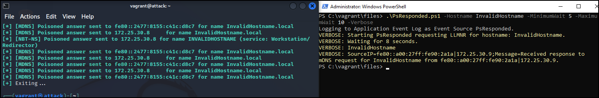

# PsResponded
This PowerShell script periodically queries LLMNR and NETBIOS for a specified hostname that should not exist on the network. 
If a response is received, this could indicate a potential spoofing attack via `Responder` or similar tools that respond to arbitrary
mDNS queries. 

The script logs the IP that responded to the Event Log (if ran as administrator) and the console. The Event Log entries are formatted to be easily parsed by `Splunk`.

The query is re-ran at a random interval to attempt to avoid detection of automated LLMNR queries by potential attackers.

## Example


A Kali VM running `Responder` is detected by the `PsResponder` script running on a Windows VM.

## Scheduled Task
The script is intended to be ran as a Scheduled Task, with a SIEM or similar system setup to monitor and alert on the Event ID
created by the script when a response is detected. 

Included in the repository is an example Scheduled Task xml file that you can import directly into Task Scheduler.

# PowerShell Help
```
.SYNOPSIS
    Periodically sends LLMNR, NetBIOS requests for a known non-existant
    host. If a response is received, this indicates a potential Responder
    spoofing attack and sends an Event ID 5005 to the Event Log.

.DESCRIPTION
    

.PARAMETER Hostname
    Known non-existant hostname, if a response is received to this hostname
    an event is logged.

.PARAMETER Unregister
    Removes the Event Source from the Event Log service.

.PARAMETER MinimumWait
    Minimum seconds to wait between requests.

.PARAMETER MaximumWait
    Maximum seconds to wait between requests.

.PARAMETER DwellTime
    Seconds to wait after receiving a response before another attempt is made.
    Defaults to 1200 seconds, which is how long a response is cached. 

    Any shorter than 1200 will result in potential false positive as the result
    would potentially come from cache.

.EXAMPLE
    Start sending periodic request, waiting between 7 minutes and 2 hours with a
    1200 second dwell time between requests when a response is received.

        PS C:\> .\PsResponded.ps1 -Hostname abc123 `
        >> -MinimumWait 420 -MaximumWait 7200 -DwellTime 1200

.EXAMPLE
    Unregister the Event Source from Event Logs if not used anymore.

        PS C:\> .\PsResponded.ps1 -Unregister
```